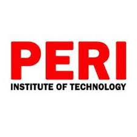

# Hey, this is Ranjith! 👋 Welcome to my profile 
### You can view my projects [here](#) 

### Education

- 🎓 Completed my bachelors in 2020 from Peri Institute
- 📚 Currently pursuing my masters in Computer Science at CSUDH

 &nbsp;&nbsp;&nbsp;&nbsp;&nbsp;&nbsp;&nbsp;&nbsp; 

### Work Experience 

- 💼 Worked as CSR in Teleperformance (Jan 2021 - Sep 2021) 
- 💼 Worked as CSA in Sutherland (Jan 2022 - Jul 2022) 

 &nbsp;&nbsp;&nbsp;&nbsp;&nbsp;&nbsp;&nbsp;&nbsp;   
  

